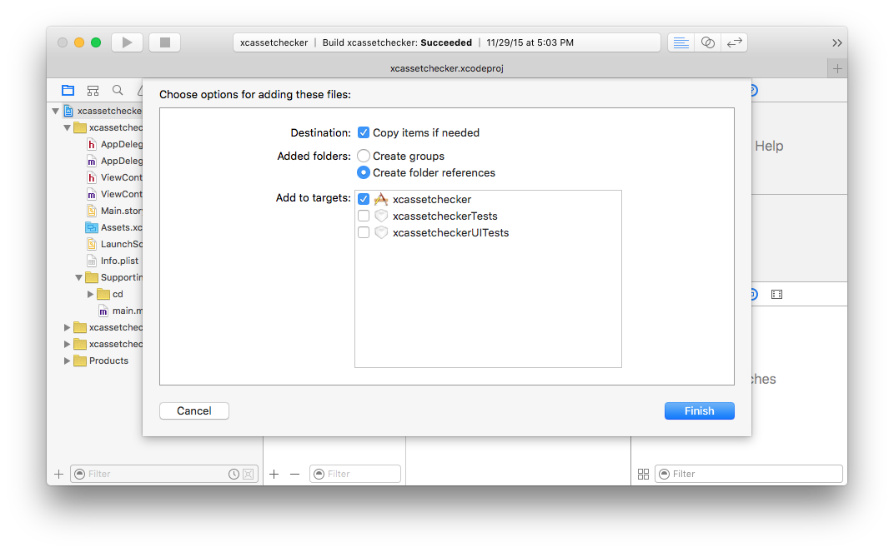

# AssetChecker - Final Project

### Description
The purpose of the AssetChecker is to examine an Xcode project, and ensure
that all assets (images, etc) that are referenced in the project
exist inside the Xcode project's folder and not elsewhere on the disk.  Since
it is possible to reference an asset outside the project folder, this means that if
you submit your Xcode project to source control, or zip it up to give to
someone else, then it will be missing any files not inside the project folder.  Upon opening your project
elsewhere, the missing files will show up in red text.

### Usage
Running the script in your Xcode project folder should give you a list of any missing assets, and also any assets that exist in the project but are not referenced in the project (.xcodeproj) package file.

### Xcode File Copy Dialog Box

The best way to copy an asset into Xcode is to have Xcode open, then you either drag and drop or select a folder, right click, and choose the Add Files... option.  With Xcode open, you can be sure that the asset is also being included (written) in your Xcode project file.  This is important because if the file is not in the project file, it can't get copied during the build process into your application.

Here's the dialog box in Xcode 7:

There is a lot going on in the dialog box.  It is asking if it should copy a file into the Xcode project folder if it does not already exist.  This is really the option to always use.  If the file is already in the project, then no harm done it doesn't do anything, and if it is outside it copies it over.

The tricky thing here is that the "Copy item if needed" box MUST be checked if an asset outside of the project is to be physically copied so that it is inside the Xcode's project folder on your disk.  If this is unchecked, then Xcode will create a reference to wherever it is on your hard disk and will use it from that location (/home/icon.png for example).  If you zip up your project, or push it to source control, and someone else puts it on their computer, then the Xcode project will still look for the file at /home/icon.png and if the user doesn't happen to have that file there then it will be missing from the project.

### Inspiration
The inspiration for this project comes from two sources.  I have an app with thousands of assets, and in the build process newly created images are copied over.  Adding a few new images to an Xcode project in the Add Files dialog can be annoying and error prone if thousands of images are showing.  It also possible for me to think that all files are included, but don't want to go through the time-consuming process of visual verification, and then end up putting out a build with missing assets.  This project can provide me with a sanity check that all files inside my assets folder are indeed referenced in the Xcode project, and that I don't have any stray files which may indicate some other problem.

The second inspiration is from teaching.  Students would submit their projects all the time with missing files.  Xcode can be a confusing IDE for people new to it, so it really is easy to forget to include files.  If there was a way to people to verify their project contained all necessary files, then that would save me sending an email and have them resubmit their project with all the needed files.

A common way this happens is that an assignment has some included assets, like icon files.  The student downloads them to their Mac's downloads folder, then adds them to their project without selecting copy from their file copy dialog box.  Now Xcode will look in /home/student-username/downloads when I open the project on my computer, and of course it can't find the file.  Then I either fix their project myself with a copy of the files I have, or send an email asking them to resubmit.

# Implementation Details

The Xcode project file is just a package, so I can browse into it just like it is possible with a directory.  This makes it possible to parse the part of the project file which contains all file references.  The file is just plain text which makes it easy.

The Xcode project file will

# Goals
* Find any images that are not included in the project folder
* Find any images that exist in the project but are not needed by the project

# Possible goals:
* Find any @3x or @2x images that don't have their counterparts

